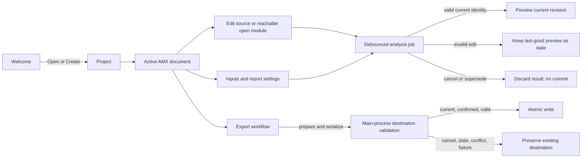
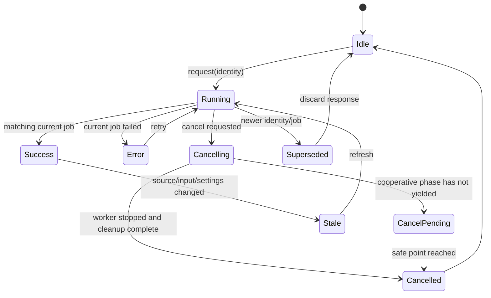

# Sprint 035 Contract Evidence

## Authority and Ratification

`planning/openamxV06ProductUXContract.md` remains the proposed behavior source for V0.6 desktop work. This evidence package proposes no amendments. The Lead Developer's explicit ratification is not present in the repository at Builder start; therefore contract status is **PENDING APPROVAL**. The V0.2-V0.5 specifications remain authoritative for their existing language, data, report, export, CLI, and VS Code behavior.

## Compatibility Matrix

| Surface | Preserved contract | Sprint 035 evidence boundary |
| --- | --- | --- |
| V0.2 source and execution | Exact backtick `amx` fences; narrative and ordinary fences inert; original UTF-16 locations; source-order evaluation; final-environment interpolation; canonical fence formatting | No grammar or evaluation changes. Overlay uses the existing parser/checker/evaluator path. |
| V0.3 type/data/module behavior | Additive typed records, explicit imports/exports, entry-only inputs, JSON duplicate-key rejection, RFC 4180 CSV, validation order, output eligibility | No data or diagnostic rules changed. CLI regression remains a required gate. |
| V0.4 views and reports | Typed views, show-time snapshots, source/view order, standalone HTML/PDF semantics and atomic destination rules | No renderer, view, or report changes. |
| V0.5 identity and exports | Version-1 project config, report/frontmatter precedence, visible source default, sanitized logos, shared prepared report, format-native HTML/PDF/DOCX behavior | No metadata, report, export, or CLI behavior changes. |
| CLI | Existing no-option `run`/`render`, path bases, flags, outputs, and diagnostics | Existing examples and CLI tests must remain green; the loader option is absent unless explicitly passed by a trusted caller. |
| VS Code | Direct Node providers, pure analysis, current behavior and host API | No extension source changed. Shared extraction is a later accepted implementation decision. |
| Desktop | Main-process filesystem/evaluation/dialog/export authority; bounded typed RPC; sandboxed preview | Current designated-entry implementation is evidence only, not V0.6 approval. No webview privilege is added. |

## Screen and State Inventory

| Screen | Empty | Loading/running | Paused/stale | Error/conflict | Success/recovery/cancel |
| --- | --- | --- | --- | --- | --- |
| Welcome | Create/Open, recents empty state | Project restore progress | Not applicable | Invalid recent/open failure | Open/create success, recovery notice, cancel returns to welcome |
| AMX workbench | No active document | Debounced analysis/preview and explicit Run progress | Pause prevents refresh; invalid edits retain visibly stale last-good output | Inline parser/checker/link diagnostics; conflict blocks dependent work | Current revision label; cancellation never reports success |
| Data editor | Empty file/schema-unmapped state | First virtual viewport and validation progress | Data validation pause is explicit; stale schema status is labeled | Parse/schema diagnostics and disk conflict | Saved revision, undo/redo; cancel retains exact raw text |
| Inputs | Declared inputs with missing mappings | Picker/load/validation progress | Last mapping state remains labeled stale | Missing/invalid mapping and private-path redaction | Valid mapping source; Cancel changes nothing |
| Report settings | Inherited defaults shown | Asset validation | Not applicable | Field-specific validation or config conflict | Saved project default/document override; cancel discards modal edits |
| Export | Format/destination selection | Prepare/serialize progress with cancel where safe | Superseded job cannot appear current | Invalid/stale destination, overwrite conflict, or export error | Open/Reveal after atomic commit; cancel preserves destination |
| Runtime drawer | Idle summary | Current job phase/progress | Paused/cancel-pending is distinguished | Parser, input, runtime, and export failures stay categorized | Revision-bound result summary; no private content dump |
| Conflict/recovery | No pending conflicts or snapshots | Compare/read/recovery scan | Keep-editing leaves conflict unresolved | Compare/reload/discard/keep-editing; failed save retains buffers | Restore/discard snapshot; cancel leaves state intact |
| Trash | Empty-trash state | Restore/empty operation pending | Not applicable | Collision or changed-source failure | Restore/empty confirmation and result; cancel mutates nothing |

### Principal Flows

The required operation identity is `{ canonicalActiveUri, projectGeneration, documentRevision, inputSettingsRevision, jobId }`. A result may update visible state only when every identity field still matches. Final writes require a second main-process check after prepare/serialize and before atomic replacement. These are target rules, not proven current desktop behavior.

## Menus, Commands, and Focus

| Menu | Commands | Shortcut/focus rule |
| --- | --- | --- |
| File | New Project, Open Project, Open File, Save, Save All, Close Project, Export, Quit | `Ctrl/Cmd+O` opens a project; editor-native save/text commands take precedence; quit uses the same conflict barrier. |
| Edit | Undo, Redo, Cut, Copy, Paste, Find, Replace, Select All | Native/editor commands are not intercepted by application shortcuts. |
| View | Explorer, Inputs, Runtime Drawer, Preview, Source Focus, Preview Focus, System/Light/Dark | Escape closes transient UI and restores its invoker; focus modes preserve selection/scroll. |
| Help | Search Help, Keyboard Shortcuts, Starter Examples, Release Notes, Export Diagnostic Log | Log export is bounded and omits source, input contents, credentials, and private paths. |

Command palette and native menu items share stable command IDs, enabled reasons, and handlers. Contextual icon-only controls require accessible names and tooltips. Split/drawer resizing has keyboard alternatives. No shortcut is assigned to silent overwrite or a destructive project operation.

## Visual Tokens and Layout

The low-fidelity viewer uses the contract's existing visual baseline, not a new brand decision:

| Token | Value | Use |
| --- | --- | --- |
| Paper | `#FFFFFF` | Light document surface |
| Workbench | `#F5F7F7` | Light application surface |
| Border | `#C5CDCF` | Base divider token; prototype uses `#405459` light and `#637A7E` dark for essential boundaries after contrast checks |
| Ink | `#18282D` | Primary text |
| Secondary ink | `#405459` | Secondary text after contrast check |
| Focus | `#075A82` | Focus ring and essential controls |
| Error | `#A52626` | Error with text/icon cue |
| Success | `#166534` | Success with text/icon cue |
| Neutral accent | `#146C94` | Decoration; not sole status cue |

Use 4/8/12/16/24/32 px spacing, 14-16 px workbench body text, a 32 px minimum control target, visible 2 px focus, and reduced-motion behavior. Test each foreground/background pairing in the harness; no formal accessibility certification is implied. At 1024x720 keep explorer, active editor, and one contextual view reachable; move secondary information to a drawer/tab. The larger frame is 1440x900.

## Design References

`planning/v06-design-inputs/` is absent at review time. There are no reference images or notes to adopt, reject, or adapt. The interactive frames are based only on the written V0.6 contract and must not be treated as an approved visual design.

## Approval and Traceability

| Gate | Builder evidence | Lead Developer disposition |
| --- | --- | --- |
| Contract ratification | Compatibility matrix and state/flow package in this file; prototype at `desktop-app/spikes/sprint035-ui-harness/` | **PENDING** |
| Active-document/job identity | Identity shape and stale/cancel transitions above; current RPC still has `entry` and no job identity | **PENDING** |
| Source overlay | Focused root proof and test in `src/runtime/moduleLoader.ts` / `tests/modules.test.ts` | **PENDING** |
| Cancellable job boundary | Separate cancellation proof/evidence is required before Sprint 036 | **PENDING** |
| Host/editor/data/test approaches | Results and residuals in Sprint 035 builder evidence | **PENDING** |

Sprint 036 remains blocked until active-document request identity, source-overlay boundary, and cancellable-job approach are explicitly accepted or receive a recorded exception with owner, impact, fallback, and dependent sprint.